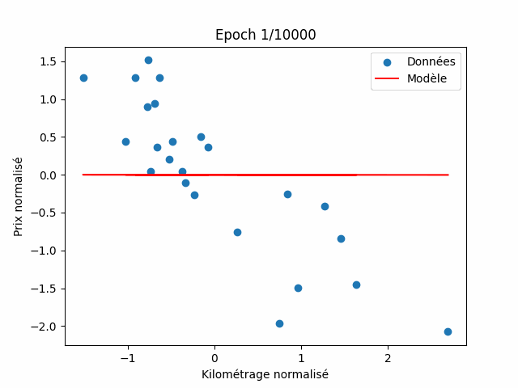

# Linear Regression - Estimation du prix d'une voiture

Ce projet implémente une régression linéaire avec gradient de descente pour estimer le prix d'une voiture d'occasion en fonction de son kilométrage.

## Fichiers

- **data.csv** : Données d'entraînement (kilométrage, prix).
- **train.py** : Script d'entraînement du modèle.
- **model.txt** : Fichier contenant les paramètres du modèle entraîné.
- **predict.py** : Script pour prédire le prix d'une voiture à partir de son kilométrage et du modèle appris.

## Utilisation

### 1. Entraîner le modèle

```bash
python train.py data.csv model.txt
```



### 2. Prédire un prix

```bash
python predict.py <kilométrage> model.txt
```

Remplacez `<kilométrage>` par la valeur souhaitée (ex: 50000).

### Exemple

```bash
python predict.py 50000 model.txt
```

## Dépendances

- Python 3.x
- numpy
- pandas
- matplotlib
- seaborn

Installez-les avec :

```bash
pip install numpy pandas matplotlib seaborn
```
